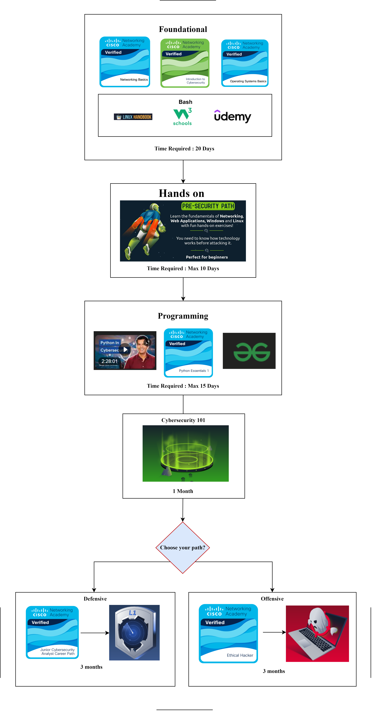

# Cybersecurity_Roadmap
🛡️ Cybersecurity Roadmap (Beginner → Junior Analyst / Ethical Hacker)




**Figure: 6 Months Cybersecurity Roadmap**

# Cybersecurity Roadmap – From Zero to Junior Analyst / Ethical Hacker

Welcome to the **Cybersecurity Roadmap** – a complete, beginner‑friendly learning path designed to take you from zero knowledge to **SOC Analyst** or **Ethical Hacker** using mostly free and minimal‑cost resources. This roadmap is structured, practical, and focused on **real‑world skills** and **hands‑on labs**.

---

## 🎯 Who This Roadmap Is For

- Students starting cybersecurity from scratch  
- Beginners with no formal IT background  
- Anyone aiming to become a **Junior Cybersecurity Analyst** or **Ethical Hacker**  
- Learners who want a **clear, free, and structured** study plan  

---

## 🧩 Roadmap Overview

The roadmap is divided into the following stages:

1. **Cybersecurity Introduction**  
2. **Fundamentals** (Networking, Operating Systems, Linux)  
3. **Programming for Cybersecurity**  
4. **Hands‑on Labs with TryHackMe**  
5. **Specialized Tracks & Thematic Room Lists**  
   - IoT Security  
   - Multimedia & Steganography  
   - Networking & Wireless  
   - Reverse Engineering & Malware Analysis  
   - AI/ML Security  
6. **FAQ – Frequently Asked Questions**

All links are intended to be **clickable** and oriented around **free or low‑cost** content wherever possible.

---

## 1. Cybersecurity Introduction

Start here if you are completely new.

- What is cybersecurity?  
- Types of roles: **SOC Analyst, Pentester, Malware Analyst, DFIR**, etc.  
- Basic terminology: threat, vulnerability, exploit, risk, CIA triad.

Recommended starting points:
- High‑level intro videos or blogs from vendors (Cisco, Microsoft, OWASP, etc.).  
- Awareness of common attack types: **phishing, malware, brute force, web attacks**.

---

## 2. Fundamentals (Networking, OS, Linux)

Before deep hacking or SOC work, get solid foundations.

### Networking

- Understand: IP addressing, ports, protocols (TCP/UDP/HTTP/DNS), OSI model, routing, subnets.  
- Practice: reading diagrams, tracing packets logically.

### Operating Systems

- Windows basics: services, users, permissions, event logs.  
- Linux basics: filesystem, users/groups, permissions, processes, systemd.

### Linux for Security

- Command line usage  
- File operations, grep, pipes, redirection  
- Basic bash scripting  

---

## 3. Programming for Cybersecurity

You do not need to be a software engineer, but basic coding helps everywhere.

Recommended focus:

- **Python** for automation, tooling, and basic offensive/defensive scripts  
- Understanding of:
  - Variables, loops, conditions  
  - Functions and modules  
  - Working with files and simple sockets/HTTP

Optional but useful:

- Basic **JavaScript** for web security
- Basic **Bash** scripting for automation on Linux

---

## 4. Hands‑On Labs (TryHackMe Focus)

Once you have core fundamentals, start structured practice with hands‑on labs.

### Suggested Flow

1. **Pre‑Security & Introductory Paths**  
   - Basic Linux, basic web, basic networking  
2. **Complete Beginner / Junior Penetration Tester / SOC Level Paths**  
   - Web exploitation basics  
   - Enumeration and privilege escalation  
   - Basic incident response and analysis  

Use these rooms and paths to build muscle memory and get used to real tools:
- `nmap`, `ssh`, `hydra`, `wireshark`, `tcpdump`, `burpsuite`, basic scripting, etc.

---

## 5. Thematic TryHackMe Room Collections

These sections are meant to be **separate `.md` files** in your repo, each dedicated to a specific area. You can maintain them as curated lists and update them as new rooms appear.

### 5.1 IoT THM Rooms (`IoT THM Rooms.md`)

Focus: **IoT security, embedded devices, router firmware, and IoT networking**.

- Introductory IoT theory  
- Networking structures around IoT  
- Practical labs: router firmware dumping, emulation, basic IoT pentesting

Example structure inside that file:

- IoT foundations (Easy)  
- IoT / embedded practical labs (Medium)  
- Advanced / IoT‑adjacent (Medium–Hard)  
- Special events (e.g., Advent of Cyber drone/IoT days)

### 5.2 Multimedia & Steganography Rooms (`Multimedia and Steganography THM Rooms.md`)

Focus: **images, audio, and file‑based steganography** + multimedia CTFs.

- Core dedicated stego rooms  
- CTFs with heavy stego elements  
- Image/audio analysis challenges  
- Good for building a toolkit: `steghide`, `exiftool`, `zsteg`, `binwalk`, etc.

Rooms listed as:

- `[CC: Steganography](https://tryhackme.com/room/ccsteganography)`  
- `[Basic Steganography](https://tryhackme.com/room/basicsteganographyal)`  
- `[Cicada-3301 Vol:1](https://tryhackme.com/room/cicada3301vol1)`  
- plus other stego‑heavy challenges.

### 5.3 Networking & Wireless Communication Rooms (`Networking and Wireless Comm THM Rooms.md`)

Focus: from **basic networking labs** to **wireless (Wi‑Fi) hacking** and more advanced traffic analysis.

Typical content:

- Introductory networking  
- LAN concepts and service enumeration  
- Network traffic basics and PCAP analysis  
- Network security essentials and firewall/log analysis  
- Wi‑Fi Hacking 101 and wireless‑specific attacks

Links are organized into:

- **Fundamentals** (Intro Networking, LAN, Nmap, Network Traffic Basics)  
- **Services & Security** (Network Services, Network Services 2, Network Security Essentials)  
- **Wireless** (Wifi Hacking 101)  
- **Advanced traffic and IR labs** (PCAP‑heavy rooms, IR/forensics‑style rooms)

### 5.4 Reverse Engineering & Malware Analysis Rooms (`Reverse_Engineering_and_Malware THM Rooms.md`)

Focus: **reverse engineering**, **assembly**, and **malware analysis**.

Sub‑sections:

- Reverse engineering foundations  
  - Windows reversing intro, x86/x64 assembly, JVM reversing, PE headers, ELF reversing, firmware dumping  
- Malware analysis module rooms  
  - Basic/Advanced Static Analysis  
  - Basic Dynamic Analysis & Debugging  
  - Anti‑RE, MalBuster, MalDoc, Windows Internals  
- Binary exploitation and RE‑adjacent content  
  - PWN101, etc.

Each entry is a clickable link with 1–2 lines of description and (optionally) difficulty tags.

### 5.5 AI & ML Security Rooms (`THM Ai-ML Related THM Rooms links.md`)

Focus: **AI/ML concepts and security threats**.

Core room:

1. `[AI/ML Security Threats](https://tryhackme.com/room/aimlsecuritythreats)`  
   - Explains AI vs ML vs DL vs LLMs  
   - Covers model lifecycle, adversarial ML, threats like prompt injection, data poisoning, model theft, privacy leakage, model drift  
   - Shows how AI can both **enhance attacks** and **strengthen defence** (SOC, IR, detection, automation)

Possible structure:

- Conceptual tasks (what AI/ML are, LLMs, transformers, RLHF)  
- Threats and attack models  
- Defensive use cases (log analysis, email detection, threat hunting, regex/rule generation)  
- “Your Cyber Assistant” practical lab section  

If more AI‑related rooms appear in the future, they can be appended to this file beneath the main one.

### 5.6 Central Roadmap File (`Roadmap.md`)

This central file (the one you are reading) links out to all the other `.md` lists and can be the **entry point** for your GitHub repository.

Suggested structure:

```markdown
- [IoT THM Rooms](./IoT%20THM%20Rooms.md)
- [Multimedia & Steganography THM Rooms](./Multimedia%20and%20Steganography%20THM%20Rooms.md)
- [Networking & Wireless Communication THM Rooms](./Networking%20and%20Wireless%20Comm%20THM%20Rooms.md)
- [Reverse Engineering & Malware THM Rooms](./Reverse_Engineering_and_Malware%20THM%20Rooms.md)
- [AI & ML Security THM Rooms](./THM%20Ai-ML%20Related%20THM%20Rooms%20links.md)
